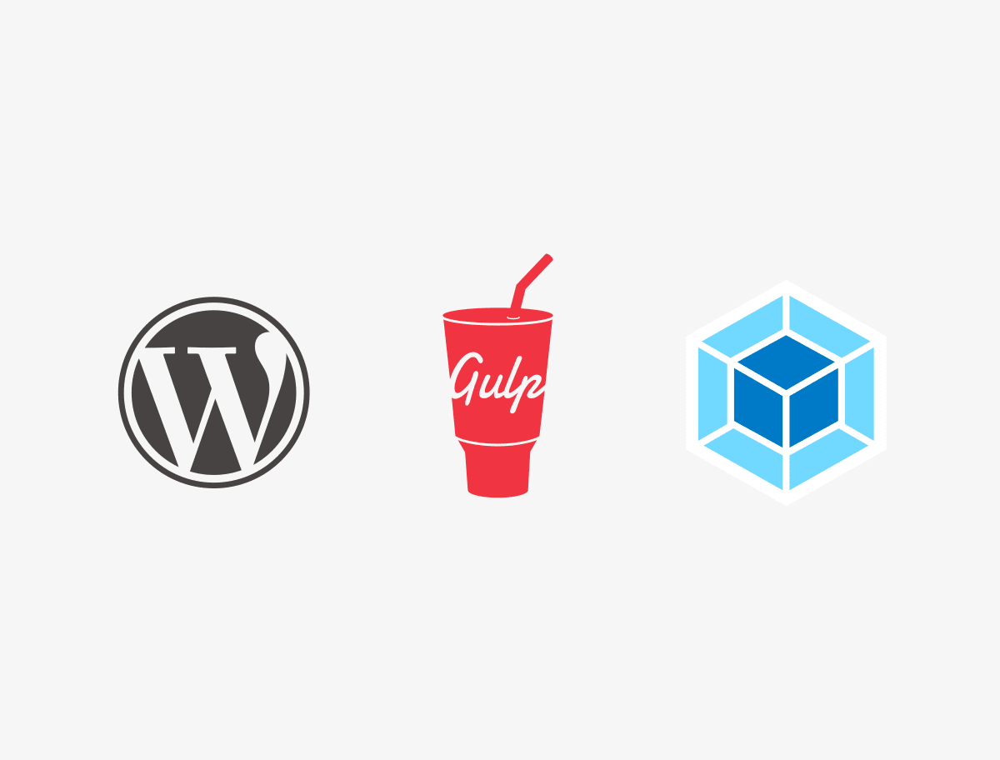

# Стартовая тема для WordPress с Gulp и Webpack

## Под капотом

- [ES6](https://github.com/lukehoban/es6features#readme) для JavaScript (перенос с помощью [Babel](https://babeljs.io/) и анализ с помощью [ESLint](https://eslint.org/))
- [SASS](http://sass-lang.com/) препроцессор для CSS [SASS Guidelines](https://sass-guidelin.es/#the-7-1-pattern)
- [Gulp 4](https://gulpjs.com/) & [Webpack 5](https://webpack.js.org/) управлять, компилировать и оптимизировать asset'ы
- SVG Sprite : создайте папку, содержащую все ваши SVG, например: `assets/src/svg/sprite` и запустите свои watch

## Требования

* [Node](https://nodejs.org/)
* [Gulp](https://gulpjs.com/docs/en/getting-started/quick-start)

## Применение

Сначала клонируйте этот репозиторий в каталог тем WordPress.

Затем выполните следующие команды в каталоге темы :

	npm install

Запустите ваш watch для asset'ов с помощью :

	npm run start

Для боевого сайта (production) создайте свою сборку с помощью :

	npm run build
